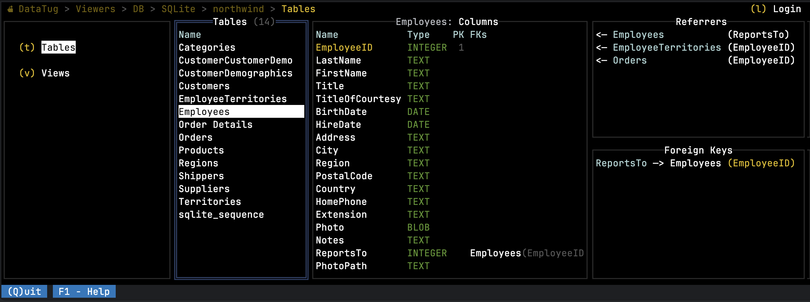

# DataTug CLI & agent for web UI

<table border=0>
    <tr>
        <td></td>
        <td>
            <p>
                DataTug is an open-source, CLI-first data exploration platform with a Web UI, designed to help you explore, query, and
                connect data across multiple sources without losing context. It automatically surfaces related data — even across
                different systems — so you can move naturally between datasets, queries, and results.
            </p>
            <p>
                Free for personal use, DataTug keeps your workflows transparent, versioned, and portable, whether you work locally, in
                GitHub, or in the cloud.                
            </p>
        </td>
    </tr>

</table>



<!-- dev-approach:v1 -->
## Our approach to development

We build with our own tooling:

- **[SpecScore](https://specscore.md)** — specify requirements as `SpecScore.md` artifacts
- **[SpecStudio](https://specscore.studio)** — author & manage specs across their lifecycle
- **[inGitDB](https://ingitdb.com)** — store structured data in Git where applicable
- **[DALgo](https://dalgo.io)** — data access layer for Go
- **[cover100.dev](https://cover100.dev)** — drive toward 100% test coverage
- **[DataTug](https://datatug.io)** — query & explore data
<!-- /dev-approach -->

## ♺ Continuous Integration — [](https://github.com/datatug/datatug-cli/actions/workflows/golangci.yml) [](https://goreportcard.com/report/github.com/datatug/datatug-cli) [](https://godoc.org/github.com/datatug/datatug-cli) [](https://coveralls.io/github/datatug/datatug-cli?branch=main)

Help wanted to [get test coverage to 100%](https://github.com/datatug/datatug-cli/issues/64).

## Installation

### macOS / Linux — curl

```bash
(p=$(mktemp) && trap 'rm -f "$p"' EXIT && curl -fsSL https://datatug.io/install/get-cli -o "$p" && sh "$p")
```

Environment overrides: `DATATUG_VERSION` (default: latest release), `DATATUG_INSTALL_DIR` (default: `~/.local/bin`).

### Windows — PowerShell

```powershell
$p=Join-Path $env:TEMP ("datatug-"+[guid]::NewGuid()+".ps1"); try { irm https://datatug.io/install/get-cli.ps1 -OutFile $p -EA Stop; & $p } finally { Remove-Item $p -EA SilentlyContinue }
```

Environment overrides: `DATATUG_VERSION`, `DATATUG_INSTALL_DIR` (default: `%LOCALAPPDATA%\DataTug\bin`). Current Windows releases support amd64.

### macOS / Linux — Homebrew ([tap](https://github.com/datatug/homebrew-tap))

```bash
brew install --cask datatug/tap/datatug
```

Homebrew gets a release only when the maintainers promote it, so it can be behind the direct installers (curl and PowerShell, which always take the latest release). `brew list --cask --versions datatug` shows the version installed.

The direct installers and Homebrew package do not require Go. See the full
[installation guide](https://datatug.io/install/) or the official
[AI-agent instructions](https://datatug.io/agent-instructions/install/).

### Updating

```bash
datatug self-update
datatug self-update --check  # report whether a newer release exists, without applying it
```

Homebrew installs run `brew update && brew upgrade --yes --cask -- datatug`; direct installs from curl or PowerShell download and checksum-verify the latest release and swap the binary in place. See [spec/features/cli/self-update](spec/features/cli/self-update/README.md).

### Installing and upgrading related CLIs

```bash
datatug install                # list ingitdb, ovdb and specscore, with install status
datatug install ovdb           # show details and install it the same way datatug itself was installed
datatug install ovdb --dry-run # report the planned action without downloading or writing anything
datatug upgrade                # report current/latest/verdict for every installed fleet CLI plus datatug itself
datatug upgrade --all          # upgrade every installed fleet CLI plus datatug itself, after one confirmation
```

`ingitdb` validates and edits the inGitDB databases DataTug reads; `ovdb`
runs a user-owned OpenVaultDB server DataTug can query as a catalog;
`specscore` lints DataTug's own specifications. `datatug upgrade` is the
fleet-wide counterpart to `self-update`: `datatug self-update` is exactly
`datatug upgrade datatug`, built from the same catalog configuration, so
the two never disagree. See
[spec/features/cli/install](spec/features/cli/install/README.md).

## What you can do with DataTug

- Explore data everywhere — SQL databases, cloud data sources, logs, and APIs (HTTP / REST)
- CLI-first workflows with a Web UI — dashboards, charts, and shared views
- Create parametrised queries and query sets for repeatable troubleshooting and investigation scenarios
- Automatically navigate related data across tables, views, APIs, and different data sources
- Build data pipelines to transform, combine, and enrich data
- Document schemas and metadata with a built-in wiki
- Version everything with Git — queries, dashboards, pipelines, and settings stored as readable project files
- Choose where your project lives:
    - Local directory (fully offline)
    - GitHub repository
    - DataTug Cloud

DataTug turns scattered data into a connected, navigable workspace — combining the speed of the CLI with the clarity of
a Web UI for exploration, troubleshooting, and collaboration.

## `datatug chat`: table narrowing

`datatug chat` normally shows the AI model the definitions of all of a project's tables on every turn. Table narrowing
decides, before each turn, which tables the model needs and shows it only those. Your own project rules are always on;
the decision model is off until **you** turn it on.

**What it does.** Before the model is asked, the chat picks the tables for the question: first your project rules, then
(if you turned it on) a decision model. Tables judged only possibly relevant stay in; so do the tables on the
foreign-key path between selected tables (when the source's foreign keys are known) and, for a follow-up such as "and by
genre?", the tables the previous turn used. The model is told the names of the tables that were left out and can read
up to two of them per turn with the read-only `describe_relation` tool. The chat prints one line naming the tables the
model was given, and the decision (engine, model, scores, tables before and after) is stored with the chat session.

**What it costs and saves, honestly.** Narrowing removes schema bytes from every request, but the model's request also
holds fixed instructions and tool definitions, and a table the model was not shown can cost a `describe_relation`
round trip, which re-sends the whole request. Measured on the 11-table Chinook sample, summed over every model call of
a turn:

| | model calls | input bytes | vs no narrowing |
|---|---|---|---|
| no narrowing | 2 | 22,059 | |
| narrowed to 3 of 11 tables | 2 | 21,369 | -3.1% |
| narrowed, and the model reads 1 omitted table | 3 | 32,785 | +48.6% |

The schema context alone goes from 1,829 to 1,111 bytes (-39%, the note naming the omitted tables included). The saving
grows with the schema (hundreds of tables, wide tables) and is small on a schema as small as Chinook's. Narrowing is
applied only when the narrowed context is at least 25% smaller than the full one; otherwise the full schema is kept.
It is not a guarantee of a better answer: a wrong narrowing is possible, which is why the omitted tables are named and
readable.

**When it cannot decide, the chat sends the full schema,** exactly as it did without narrowing: the decision model is
off, slow (more than 1.5 s by default), failing, refused (allowance spent, wrong endpoint), unsure, incomplete, the
schema is larger than 255 tables, or the narrowing would save less than 25%. After a failure the decision model is not
asked again for five minutes.

**Project rules (local, always on).** `<project>/ai/table-rules.yaml` (the format is provisional, until the decision
layer is specified):

```yaml
decision: auto            # a REQUEST for the decision model; see below. disabled (default) | auto | cloud
rules:
  - phrase: Which countries buy the most music?   # exact question; case, spacing, trailing ?!. ignored
    tables: [Invoice, Customer]                   # exact table names
```

A matching rule decides on its own and nothing leaves your machine. A rule that names a table the schema does not have,
or has an unknown key, is reported as a warning when the chat starts and never fires. A malformed file, a symbolic link,
a directory in its place or a file over 64 KiB is ignored with a warning; the chat starts anyway.

**The decision model (off until you turn it on).** With `--model cloud` the chat can ask the DataTug AI cloud, which
relays to **TypeSafe AI's Jev** decision model (an external model, not an LLM: it scores each table's relevance). When
it is on, this is sent to the DataTug cloud and from there to TypeSafe AI:

- your question, and up to the three earlier questions of the session that were asked while it was on (verbatim);
- every table name, with its column names (no column types, no rows, no values);
- the usual identifiers the cloud client already sends: an interaction id, your installation id and client version, and
  your sign-in token, which authenticates you to the DataTug cloud.

Only you can turn it on, so that opening a cloned repository never starts forwarding your questions:

- `DATATUG_AI_DECISION_PROVIDER=auto` (or `cloud`, the same plus a warning when the chat is not using `--model cloud`)
  turns it on for that session. `DATATUG_AI_DECISION_PROVIDER=disabled` always wins over everything below.
- `datatug chat --cloud-decision allow` records your consent for this project (identified by its directory, so a copy
  elsewhere does not inherit it, and a project you move or rename needs consent again) in `datatug/decision-consent.json` in your user config directory, outside the project.
  `--cloud-decision refuse` records a refusal; `--cloud-decision forget` removes the record.
- A project's own `decision: auto|cloud` only **requests** it. Without your consent it is ignored, and the chat prints one
  line at start saying so, what would be sent and to whom, and the commands above.

Whenever it is on, the chat shows one line at start, as a system line at the top of the chat (the terminal UI hides
anything printed before it starts) and on stderr for non-interactive runs, naming where the setting came from, what is sent
to whom, and how to turn it off. Rule and configuration warnings appear the same way. These lines are not messages: they
are not stored in the session and never sent to the model. `DATATUG_AI_DECISION_TIMEOUT` (a Go duration, default `1500ms`) sets how long it may take per turn. It is off
by default pending a decision on how TypeSafe AI may handle this data.

Telemetry for a decision carries counts and the engine and model ids only (for example `narrowed:before=11:after=3`),
never table names or question text, and is sent only when a decision was actually made.

## What it is and why?

This is an agent service for https://datatug.app that you can run on your local machine, or some server to allow DataTug
app to scan databases & execute SQL requests.

It can be run with your user account credentials (*e.g. trusted connection*) or under some service account.

## Would you steal my data?

No, we won't.

The project is **free and open source** codes available at https://github.com/datatug/datatug. You are welcome to
check - we do not look into your data.

The CLI does send a small amount of anonymous usage telemetry, which you can switch off: see [Telemetry](#telemetry).

## Telemetry

**What is sent.** The CLI sends anonymous usage events and crash reports to [PostHog](https://posthog.com)
(`eu.i.posthog.com`), through [`pkg/dtlog`](pkg/dtlog), the only code in this repository that can send them. We use them
to learn how often the CLI is run, which screens are opened and where it crashes, so we can fix what people hit. With telemetry on
the CLI also fetches its PostHog project key from `raw.githubusercontent.com`, once a day when that succeeds (it is retried on each run until it does): that request carries no
data of yours (GitHub sees the IP address it comes from, as any web server does), and it is not made when telemetry is off.

| Event | When | Fields it carries |
|---|---|---|
| `DataTug CLI started` | a command starts | the common fields below |
| `DataTug CLI exited` | a command ends | the common fields below |
| `Screen opened` | a screen of the terminal UI opens | the common fields, `$app_name` (`DataTug`), `$app_version`, `$screen_id` and `$screen_name` (fixed labels of DataTug's own screens, such as `viewers/sqlite` and `SQLite Viewer`) |
| `$exception` (crash report) | the CLI crashes with a panic | `distinct_id`, the SDK and system fields below, and one exception: its `type` (`panic`), its `value` (the Go type of the panic value, such as `string` or `*errors.errorString`; for a crash of the Go runtime itself, such as an index out of range, its message, which names numbers and types only) and its stack: function names, source file *names* (no directory), line numbers and code addresses; and `$debug_images`: the type, build id, load address, link address, size and architecture of the executable (not its path) |

The common fields: `uuid` (a random id of the event), `distinct_id` (a random id of this install, kept in
`~/datatug/.posthog.yaml`), `timestamp`, the
session (`$session_id`, `$session_start_time`, `$session_duration`), and what the PostHog Go SDK adds: `$lib`,
`$lib_version`, `$os`, `$os_version`, `$os_distro`, `$go_version`, `$geoip_disable` and `$is_server`. `$geoip_disable` asks
PostHog not to look up your location; as for any web request, PostHog's server still receives the IP address the request
comes from.

**What is not sent.** No database content, no query text, no project or database name, no path, no host, no user name, no
command-line argument and no credential. The text of a panic is not sent either, because it can hold a path or a host: it
goes to stderr and to the local log only. A test builds each event as `pkg/dtlog` hands it to the PostHog client and fails
when its fields change, so this list cannot drift from the code, and another test fails when any other package imports the
PostHog client. The notice is checked by tests for the claims it makes about the fields (such as which event carries the
DataTug version), and by a reader against this list when either changes.

**The first run.** The first time the CLI runs with telemetry on in a terminal (stderr is a terminal) it prints a notice
on stderr (at most six lines) saying the above in brief, and nothing is sent on that run. Events start with the next run.
The notice is printed once per user: the CLI records that it was shown in the file `~/datatug/.telemetry-notice-shown`
(delete it to see the notice again). If that file cannot be written the notice is printed again next time, and the run
does not fail. A run whose stderr is not a terminal (a script, a service, shell completion with `2>/dev/null`) tells
nobody, so it prints nothing, writes no marker and sends nothing: the notice waits for the first run in a terminal. The
same holds when the home folder cannot be resolved (a service without a home): nothing is created and nothing is sent.

**Turn it off.** Telemetry is on only when `DATATUG_TELEMETRY` is empty or one of `1`, `true`, `on`, `yes`; any other value
turns it off, so a typo never leaves you measured. Any one of these turns telemetry off completely: no notice, no client,
no request, no file:

```
DATATUG_TELEMETRY=0     # 0, false, off, no, or any value other than 1, true, on, yes
DO_NOT_TRACK=1          # any value but empty or 0 (https://consoledonottrack.com)
CI=true                 # any value but empty or false: set by most CI systems
```

A variable set in one terminal is gone in the next. To turn telemetry off for good, add `export DATATUG_TELEMETRY=0` to
your shell profile (`~/.zshrc`, `~/.bashrc`), or on Windows run `setx DATATUG_TELEMETRY 0` once. `datatug --help` names the
variable too. `datatug version --json` never sends telemetry, whatever you set.

**Chat with the DataTug cloud AI.** `datatug chat --model cloud` is your choice to use the DataTug cloud AI service: your
questions go to it to be answered, whatever the switch says, because that is what the command does. It also sends a
metadata report of each turn (the length of your message in characters and words, its status and outcome, the names of the
actions that ran, the conversation id, a random id of the turn, the client type and feature labels, and your install id, OS, CPU architecture and DataTug version; not the text of your question and not
your rows). That report is usage telemetry and follows the same switch: with `DATATUG_TELEMETRY`, `DO_NOT_TRACK` or `CI`
turning telemetry off, or on the first run, it is not sent. Its install id is a different random id from the one above,
kept in `datatug/installation_id` in your user configuration folder (`os.UserConfigDir`). Chat with your own AI profile
reports nowhere.

## Where are metadata stored?

When DataTug agent scans or compare your database it stores meta information in a datatug project as set of simple to
understand & easy to compare JSON files.

We recommend to check-in the project to some source versioning control system like GIT.

You can run commands for different projects by passing path to DataTugProject folder. E.g.:

```
> datatug show --project ~/my-datatug-projects/DemoProject
```

Paths to the DataTug project files, and their names are stored in `~/datatug.yaml` in the root of your user's home
directory.
This allows you to address a DataTug project in a console using a short alias. Like this:

```
> datatug show -p DemoProject
```

If the current directory is a DataTug project folder you don't need to specify project name or path.

```
> datatug show
```

## How to get the DataTug CLI?

Use one of the supported methods in [Installation](#installation). None requires Go.

Then verify the installed CLI:

```
> datatug --help
```

## How to run?

Check the [CLI](https://github.com/datatug/datatug) section on how to run DataTug agent.

## Supported databases

At the moment we any DB supported by [DALgo](https://github.com/dal-go/dalgo). Like:

- [dalgo2firestore](https://github.com/dal-go/dalgo2firestore)
- [dalgo2sql](https://github.com/dal-go/dalgo2sql)

### Supported `sql` Databases:

Datatug can work with `sql` DBs if a relevant driver has been linked into `datatug`

- **SQLite** - via  [github.com/mattn/go-sqlite3](https://github.com/mattn/go-sqlite3 )
- **Microsoft SQL Server** - via [go-mssqldb](https://github.com/denisenkom/go-mssqldb)

We are open for pull requests to support other `sql` DBs.

## For developers

Read [README-dev.md](docs/README-dev.md) for details on how to setup, debug, and contribute; the terminal UI architecture (shell, widgets, grid, navtest) is summarised there and explained in [tui-screens.md](docs/tui-screens.md).

## Sample Databases

### By Database Platform

- SQLite
    - [Chinook Database](https://github.com/lerocha/chinook-database)
    - [Northwind](https://github.com/jpwhite3/northwind-SQLite3)
- MS SQL Server
    - [Northwind](https://github.com/Microsoft/sql-server-samples/tree/master/samples/databases/northwind-pubs)
- Oracle
    - [Northwind](https://github.com/dshifflet/NorthwindOracle_DDL)

### Northwind Database

- [SQLite](https://github.com/jpwhite3/northwind-SQLite3)
- [MS SQL Server](https://github.com/Microsoft/sql-server-samples/tree/master/samples/databases/northwind-pubs)
- [Oracle](https://github.com/dshifflet/NorthwindOracle_DDL)

## Open Source Libraries we use

- [Bubble Tea](https://github.com/charmbracelet/bubbletea) - Terminal UI framework (The Elm Architecture) with Lip Gloss styling; shared widgets live in `tuigoff`
- [DALgo](https://github.com/dal-go/dalgo) - Database Abstraction Layer for Go
- https://gihub.com/strongo/validation - helpers for requests & models validations

## Contributing

We welcome contributions to DataTug! Please read our [contributing guidelines](docs/CONTRIBUTING.md) for more
information on how to contribute to the project.

## Download

http://datatug.app/download

# [License](./LICENSE)

Apache License
