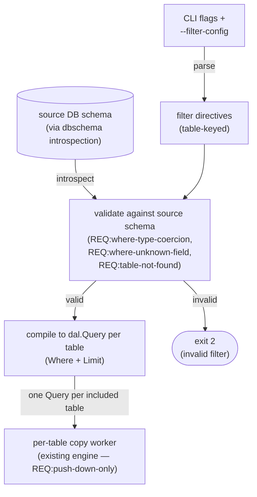

# Feature: `datatug db copy` filtering and subsetting

> [View in SpecStudio](https://specstudio.synchestra.io/project/features?id=datatug-cli@datatug@github.com&path=spec%2Ffeatures%2Fcli%2Fdb%2Fcopy%2Ffiltering) — graph, discussions, approvals

**Status:** Approved
**Source Idea:** [`db-copy-filtering`](../../../../../ideas/db-copy-filtering.md)
**Parent Feature:** [`cli/db/copy`](../README.md)

## Summary

Extends [`datatug db copy`](../README.md) with three orthogonal subsetting axes — table include/exclude, structured row predicates (AND-only in MVP), and per-table row limits — all exposed both as CLI flags and as a YAML config-file schema. Row predicates compile to DALgo's `dal.WhereField` and push down to the source backend's query engine; pull-down filtering is out of scope for MVP because every supported source backend (SQLite, inGitDB) can push. The CLI surface uses a colon-delimited mini-syntax (`--where <table>:<field>:<op>:<value>`). **Column subsetting and OR-groups are both deferred** to follow-up Features (see [Out of Scope](#out-of-scope)) — the former because DALgo lacks a `QueryBuilder.SelectFields(...)` projection method, the latter because DALgo's `GroupCondition` struct has unexported fields and no public constructor. This Feature is what makes [`db snapshot`'s](../../../../../ideas/db-snapshot-command.md) config-file forwarder useful for the three covered axes — without it, snapshots can only capture whole databases.

## Synopsis

```
datatug db copy --from <url> --to <url>
                [--include <t1,t2,…>]        | [--exclude <t1,t2,…>]
                [--where <table>:<field>:<op>:<value>]…
                [--limit <table>:<N>]…
                [--filter-config <path-to-yaml>]
                [<existing copy flags: --overwrite, --parallel-streams, --progress>]
```

**MVP scope: column subsetting deferred.** `--columns`, `--exclude-columns`, and `--exclude-columns-global` are NOT in MVP. A plan-time audit of `dal-go/dalgo` found that `QueryBuilder` exposes no explicit field-projection method; the existing surface (`SelectIntoRecordset`, `SelectIntoRecord`, `SelectKeysOnly`) returns whole records. REQ:push-down-only forbids a pull-down "read all, drop in copy engine" workaround, so column subsetting requires upstream DALgo work — a `QueryBuilder.SelectFields(...dal.FieldName)` (or equivalent) extension landing in `dal-go/dalgo`, plus driver coverage in `dalgo2sqlite` and `dalgo2ingitdb`. That extension is filed as a sibling Idea (`dalgo-query-projection`, to be drafted) and will produce a follow-up DataTug Feature `cli/db/copy/filtering/columns/` once the upstream work lands. See [Out of Scope](#out-of-scope).

## Problem

`datatug db copy` today copies whole databases: every table, every row, every column. The parent [`db-snapshot-command`](../../../../../ideas/db-snapshot-command.md) Idea makes config-file-driven snapshots its MVP, and that config file's only meaningful content is *which subset to capture* — recent customers, exclude `audit_log`, drop `create_time`/`update_time` columns globally. Without subsetting in `db copy`, snapshot's config-file surface has nothing useful to forward.

DALgo already exposes the surfaces needed: `dal.WhereField(name, op, value)` for field-op-value predicates, `dal.GroupCondition` for AND/OR composition, structured queries with limits and field projection. The inGitDB backend executes structured queries natively; the SQL-text fallback path (`dal.NewTextQuery`) used by `dalgo2sql` for Postgres/SQLite handles the cases where StructuredQuery doesn't compile. Filtering is therefore not a green-field feature — the seam exists. This Feature pins how `db copy` exposes it as a CLI surface and a config-file schema.

## Behavior

### Table selection

#### REQ: include-flag

The `--include` flag MUST accept a comma-separated list of source table names. When present, exactly those tables are copied; any source table not in the list is skipped. Table names MUST match source-table names exactly (case-sensitive per the source backend's collation rules); the implementation MUST NOT lowercase, normalize, or fuzzy-match.

#### REQ: exclude-flag

The `--exclude` flag MUST accept a comma-separated list of source table names. When present, every source table is copied EXCEPT those in the list. Matching rules are the same as REQ:include-flag (exact, case-sensitive).

#### REQ: include-exclude-mutex

`--include` and `--exclude` MUST be mutually exclusive on the same invocation. Supplying both MUST exit `2` (InvalidArgs) with a stderr message naming both flags. Combining them in the same config file (top-level `include:` AND `exclude:` keys both populated) MUST exit `2` with the analogous message.

#### REQ: table-not-found

If any name in `--include` or `--exclude` does not exist on the source after introspection, the command MUST exit `2` BEFORE any write, with stderr naming the unknown table(s). The check happens after source introspection (REQ:source-schema-via-dbschema in the parent Feature) and before any target writes.

### Row filters

#### REQ: where-cli-syntax

The `--where` flag MUST accept a colon-delimited 4-tuple `<table>:<field>:<op>:<value>` and MUST be repeatable. Field names follow source-side casing (REQ:include-flag). Values are decoded as strings; type coercion to the column's native type happens at predicate-compile time (REQ:where-type-coercion). A literal colon inside the value MUST be escapable with `\:`. Whitespace inside the value is preserved verbatim — shells are expected to quote values containing spaces.

#### REQ: where-and-semantics

When multiple `--where` flags target the same `<table>`, the predicates AND together. OR composition is deferred from MVP (see [Out of Scope](#out-of-scope)) — both the CLI and the YAML config schema accept only AND-composed predicates.

#### REQ: operator-vocabulary

The fixed MVP operator vocabulary MUST be exactly:

| Token | Semantic | DALgo `dal.Operator` mapping |
|---|---|---|
| `=` | equals | `dal.Equal` |
| `<` | less than | `dal.LessThen` (note: DALgo's constant uses "Then" not "Than" — typo in upstream, preserved) |
| `<=` | less than or equal | `dal.LessOrEqual` |
| `>` | greater than | `dal.GreaterThen` (same DALgo typo) |
| `>=` | greater than or equal | `dal.GreaterOrEqual` |
| `in` | value-in-comma-list | `dal.In` (value is comma-split inside the 4-tuple's `<value>` slot) |

Any other operator token in `--where` MUST exit `2` with stderr listing the supported set.

**Deferred operators.** `!=`, `not_in`, `is_null`, and `is_not_null` are NOT in MVP — a plan-time audit found that `dal-go/dalgo` does not expose `NotEqual`, `NotIn`, `IsNull`, or `IsNotNull` constants (only the six above plus `And`/`Or` for grouping). They require an upstream DALgo PR (sibling Idea to be filed: `dalgo-extended-operators`) before they can land. See [Out of Scope](#out-of-scope).

#### REQ: where-type-coercion

Values are decoded by attempting type coercion against the column's introspected `dbschema.Type` in this order: integer, float, boolean (`true`/`false` case-insensitive), date (ISO-8601 `YYYY-MM-DD`), datetime (ISO-8601), string fallback. If coercion fails for the column's expected type, the command MUST exit `2` with stderr naming the table, field, attempted value, and expected type. (Every operator in the MVP vocabulary takes a value; null-test operators are deferred per REQ:operator-vocabulary.)

#### REQ: where-unknown-field

If the field name in a `--where` 4-tuple does not exist on the introspected source table, the command MUST exit `2` BEFORE any target write, with stderr naming the table, field, and offering the closest source-side field name (Levenshtein distance ≤ 2) if one exists.

### Row limits

#### REQ: limit-flag

The `--limit` flag MUST accept a colon-delimited 2-tuple `<table>:<N>` where `N` is a positive integer, and MUST be repeatable. At most one `--limit` per table is allowed; duplicates MUST exit `2`. Tables without a `--limit` entry have no row limit applied.

#### REQ: limit-compiles-to-dalgo-limit

`--limit <table>:<N>` MUST compile to DALgo's structured `Limit(N)` clause on the per-table read query. The implementation MUST NOT achieve limiting by reading more rows than requested and discarding the remainder (REQ:push-down-only).

### Column subsetting (deferred)

Column subsetting (`--columns`, `--exclude-columns`, `--exclude-columns-global`) is **not in MVP** — see [Synopsis](#synopsis) and [Out of Scope](#out-of-scope) for the reason (no `QueryBuilder` projection API in DALgo today; REQ:push-down-only forbids a pull-down workaround). A future Feature `cli/db/copy/filtering/columns/` will land once the upstream `dalgo-query-projection` Idea ships.

### Push-down semantics

#### REQ: push-down-only

All filtering (table include/exclude, row WHERE, row LIMIT) MUST be applied at the source query level — compiled into the `dal.StructuredQuery` (or its `dal.NewTextQuery` fallback for `dalgo2sql`) that the source `dal.Adapter` executes. The implementation MUST NOT read full rows from the source and discard rows in the copy engine. This rule is what makes "1000 latest customers from a 100k-row table" cheap; violating it would re-introduce the inefficiency the Idea explicitly rejected.

#### REQ: backend-coverage

For MVP, the implementation MUST support push-down for all three filter axes on both source backends in the parent Feature's E2E pair: `sqlite` (via `dalgo2sqlite`) and `ingitdb` (via `dalgo2ingitdb`). If a future backend's driver lacks coverage for an axis, the command MUST exit `1` BEFORE any write, with stderr naming the source backend and the unsupported axis. (Pull-down fallback is explicitly deferred per the Out of Scope section.)

### Config-file forwarding

#### REQ: filter-config-flag

The `--filter-config <path>` flag MUST accept a path to a YAML file containing filter directives. When present, the file is parsed and each directive is translated into the equivalent CLI-flag effect (REQ:config-cli-equivalence) before any other filtering takes effect.

#### REQ: config-cli-equivalence

A config file's effect MUST be identical to the equivalent flags-only invocation. For every config key with a flag equivalent, the resolved (post-parse, pre-compile) `dal.Query` MUST be byte-identical to the flag-form. Mixing `--filter-config` with flag overrides of the same axis MUST exit `2` (no flag-vs-config merging in MVP). OR-groups are deferred (see [Out of Scope](#out-of-scope)) — both CLI and config-file surfaces accept only AND-composed predicates in MVP.

#### REQ: config-file-schema

The config file's YAML schema MUST be exactly:

```yaml
# All keys optional. Empty/missing = no constraint.
include: [<table>, …]                    # mutex with `exclude`
exclude: [<table>, …]                    # mutex with `include`
where:
  <table>:
    - {field: <name>, op: <op>, value: <v>}    # AND across list entries
limit:
  <table>: <positive-int>
```

Two YAML keys are **reserved** for deferred follow-up Features and MUST be rejected with exit `2`:

- A top-level `columns:` key — reserved for the deferred column-subsetting follow-up Feature (`cli/db/copy/filtering/columns/`).
- An `or:` key nested inside a `where:<table>:` list entry — reserved for the deferred OR-group follow-up Feature, gated on the upstream `dalgo-group-condition-ctor` Idea (to be filed) that adds a public constructor for `dal.GroupCondition` (DALgo's current API exposes `GroupCondition` with unexported fields and no factory).

Any other unrecognized top-level key MUST also exit `2`. Inside `where:<table>:`, each list entry MUST be an object with exactly the keys `{field, op, value}` — any other key (including `or:`) is rejected with the deferral message.

### Interaction with existing `db copy` ACs

#### REQ: copy-acs-no-filter-baseline

The existing `db copy` ACs (`sqlite-to-ingitdb-chinook-roundtrip` and siblings) MUST remain valid as "no filtering flags" baseline behavior. When this Feature lands, the parent `cli/db/copy` Feature MUST be amended to note that those ACs assume no `--include` / `--exclude` / `--where` / `--limit` / `--filter-config` flag is present.

### Error handling and exit codes

#### REQ: exit-codes

| Exit code | Meaning |
|---|---|
| `0` | All copy work completed; filters applied as specified |
| `1` | Push-down unsupported on a source backend for an axis used (REQ:backend-coverage), or generic runtime error |
| `2` | Invalid filter flag (mutex violation, unknown operator, unknown table, unknown field, type-coercion failure, malformed config, mixed config+flag, reserved `columns:` key in config) |

Exit codes `4` (connection failure) carry over unchanged from the parent Feature.

## Architecture

### Components

| Component | Responsibility | Lives in |
|---|---|---|
| `pkg/dbcopy/filter` (proposed) | CLI flag parsing for `--include`/`--exclude`/`--where`/`--limit`; YAML config parsing for `--filter-config`; compilation to `dal.Query` per source table | this repo (new package) |
| `pkg/dbcopy/filter/operator.go` (proposed) | Fixed operator vocabulary (REQ:operator-vocabulary); token → `dal.Operator` map; rejection of unknown tokens | this repo |
| `pkg/dbcopy/filter/coercion.go` (proposed) | Value-to-type coercion (REQ:where-type-coercion); uses introspected `dbschema.Type` | this repo |
| `pkg/dbcopy/engine.go` (existing) | Calls into the filter package to build per-table `dal.Query`; passes the resulting query to source `dal.Adapter.ExecuteQueryToRecordsReader` | this repo (modified) |
| `dal.QueryBuilder.Where` / `WhereField` / `Limit` | DALgo structured-query construction primitives — confirmed at plan time | `dal-go/dalgo/dal` (existing) |
| `dalgo2sqlite` query compiler | StructuredQuery → SQLite text for cases where StructuredQuery isn't executed natively | `dal-go/dalgo2sqlite` (existing; plan-time audit for Where + Limit completeness) |
| `dalgo2ingitdb` query executor | Native StructuredQuery execution against the file tree | `ingitdb/ingitdb-cli/pkg/dalgo2ingitdb` (existing; plan-time audit for Where + Limit coverage) |

### Data flow



### Dependencies

- **`cli/db/copy`** (parent Feature, Implemented) — extends its CLI surface and its copy engine. This Feature does NOT change `db copy`'s URL-parsing, schema-introspection, target-DDL, or overwrite/concurrency rules; those continue to apply unchanged.
- **DALgo `dal.QueryBuilder` / `WhereField` / `Limit`** — `dal-go/dalgo` — **Audited at plan time:** `WhereField` (line 87 of `dal/q_builder.go`), `GroupCondition` (verified at Idea time), and `Limit` (line 72) all exist on the public `QueryBuilder` API. **Field projection (`SelectFields(...)` or equivalent) does NOT exist** — the only `Select*` methods are `SelectIntoRecord`, `SelectIntoRecordset`, `SelectKeysOnly`, none of which subsets columns. This is why column subsetting is deferred (see [Synopsis](#synopsis), [Out of Scope](#out-of-scope)).
- **`dalgo2sqlite` StructuredQuery → SQLite SQL compiler** — `dal-go/dalgo2sqlite` — **Plan-time audit required.** Verify Where + Limit compile to correct SQLite SQL for the Chinook fixture.
- **`dalgo2ingitdb` query execution** — `ingitdb/ingitdb-cli/pkg/dalgo2ingitdb` — **Plan-time audit required.** Verify Where + Limit execute correctly against an inGitDB tree.

## Testing Strategy

E2E tests against the canonical Chinook fixture, exactly mirroring the parent Feature's bar: SQLite ↔ inGitDB in both directions, Postgres deferred. New test classes:

| Filter axis | E2E test target |
|---|---|
| `--include` (table whitelist) | `db copy --include Customer,Invoice` produces a target with exactly those two collections, row counts matching source |
| `--exclude` (table blacklist) | `db copy --exclude Genre` produces a target missing exactly that collection |
| `--where` (single condition) | `db copy --where Customer:Country:=:USA` produces a target Customer collection with exactly source's `WHERE Country = 'USA'` row count |
| `--where` (AND, multiple flags) | `db copy --where Customer:Country:=:USA --where Customer:SupportRepId:=:3` AND-composes |
| `--limit` | `db copy --limit Invoice:50` produces a target Invoice collection with exactly 50 rows |
| Combined axes (REQ:config-cli-equivalence equivalence) | One invocation combines all three axes and a `--filter-config` invocation with the YAML equivalent — outputs MUST be byte-identical |
| Reserved `columns:` key rejected | A `--filter-config` whose YAML contains a top-level `columns:` key exits `2` with stderr naming the deferral |
| Reserved nested `or:` key rejected | A `--filter-config` whose YAML contains an `or:` subkey inside `where:<table>:` exits `2` with stderr naming the OR-group deferral |

Unit tests cover: operator vocabulary (REQ:operator-vocabulary), type coercion (REQ:where-type-coercion), CLI mini-syntax parser including `\:` escape (REQ:where-cli-syntax), YAML schema parser including the reserved-`columns:` and reserved-`or:` rejections (REQ:config-file-schema), mutex enforcement (REQ:include-exclude-mutex), unknown-field/table error paths (REQ:table-not-found, REQ:where-unknown-field).

## Rehearse Integration

All ACs below are testable via `go test ./...` plus shell-driven E2E runs invoking the built `datatug` binary. No new external scaffolding beyond what the parent `cli/db/copy` Feature already requires. Per-AC Rehearse stubs will be scaffolded under `spec/features/cli/db/copy/filtering/tests/` as part of plan-time work.

## Out of Scope

Inherited from the source Idea, reinforced at Feature-spec time:

- **Referential-integrity-aware subsetting** — auto-including parent rows referenced by selected children. User-responsible; this is a "capture subset" tool, not a "consistent subset" tool. Filtered children may dangle.
- **OR-groups in row predicates** (both CLI and YAML config) — **DEFERRED.** DALgo's `dal.GroupCondition` struct has unexported fields and no public constructor (or `Or(...)` factory), so external packages cannot compile `(a OR b)` predicates today. Requires an upstream sibling Idea `dalgo-group-condition-ctor` (to be filed in `dal-go/dalgo/spec/ideas/`) that adds either `dal.NewGroupCondition(op, conds...) Condition` or `func Or(conds...) Condition`. A follow-up DataTug Feature will re-introduce OR-groups once the upstream work tags a release. MVP CLI and YAML both accept only AND-composed predicates; the YAML schema reserves the `or:` subkey and rejects it with a clear deferral message (REQ:config-file-schema).
- **Raw SQL passthrough** (`--raw-where`) — chosen against in favor of structured predicates for portability. Future Idea if real users hit the operator-vocabulary limit.
- **Pull-down filtering** (read all, filter in copy engine) — every MVP backend pushes; REQ:backend-coverage exits `1` on unsupported axes, no fallback.
- **Column subsetting** (`--columns`, `--exclude-columns`, `--exclude-columns-global`) — **DEFERRED.** `dal-go/dalgo`'s `QueryBuilder` exposes no explicit field-projection method today; REQ:push-down-only forbids reading-all-columns-and-dropping-in-engine. Requires an upstream sibling Idea (`dalgo-query-projection`, to be filed in `dal-go/dalgo/spec/ideas/`) that adds `QueryBuilder.SelectFields(...dal.FieldName)` (or equivalent) plus driver coverage in `dalgo2sqlite` and `dalgo2ingitdb`. A follow-up DataTug Feature `cli/db/copy/filtering/columns/` will land once that upstream work tags a release. MVP `--filter-config` rejects any YAML containing a top-level `columns:` key (REQ:config-file-schema).
- **Anonymization / data masking / column transformation** — separate concern; even when column subsetting lands, it will drop columns rather than redact or transform values.
- **Subqueries, joins, computed columns in WHERE** — the structured surface doesn't support them.
- **Wildcards or regex in table names** (`--include 'log_*'`) — explicit list only.
- **Extended operators** (`!=`, `not_in`, `is_null`, `is_not_null`) — **DEFERRED.** A plan-time audit found that `dal-go/dalgo` does not expose `NotEqual`, `NotIn`, `IsNull`, or `IsNotNull` constants — only the six covered by REQ:operator-vocabulary plus `And`/`Or` for grouping. Requires an upstream sibling Idea `dalgo-extended-operators` (to be filed in `dal-go/dalgo/spec/ideas/`) that adds the four missing constants. A follow-up DataTug Feature will re-introduce them once the upstream work tags a release. The painful loss in MVP is `is_null`/`is_not_null` (no way to filter on soft-delete sentinels without a NULL test); users who need this can WHERE-equal against a known non-null sentinel value if their schema permits.
- **Operator extensions beyond DALgo's current set + the four-deferred batch** — `like`, `between`, `regex`, et al. Stay deferred; revisit only after the four-deferred batch lands and real-user demand surfaces.
- **Postgres source/target** — deferred to match the parent Feature's current MVP scope (parent `db copy` defers Postgres until a Postgres DALgo driver lands `dbschema.SchemaReader` + `ddl.SchemaModifier` + `dal.ConcurrencyAware`).
- **Flag overrides over config (`--filter-config base.yaml --where extra:…`)** — REQ:config-cli-equivalence rejects mixing in MVP. Layered configs may revisit.
- **Mutating filter behavior at the target** — filters only narrow what is *read* from source; target writes use the standard parent-Feature path. No target-side filtering (e.g. INSERT-then-DELETE) is added.

## Assumption Carryover

From the source Idea:

| Idea assumption | Status at Feature time |
|---|---|
| Must-be-true: DALgo's `dal.StructuredQuery` surface — `WhereField`, `GroupCondition`, `Limit`, and explicit field projection — compiles correctly across MVP backends | **Partially resolved at plan time:** `WhereField`, `GroupCondition`, and `Limit` exist and compile across MVP backends (verified in `dal-go/dalgo/dal/q_builder.go`). **Explicit field projection does NOT exist** — column subsetting is therefore deferred to a follow-up Feature gated on the `dalgo-query-projection` sibling Idea. REQ:backend-coverage codifies the runtime check for the remaining axes (Where, Limit). |
| Must-be-true: The fixed operator vocabulary covers ≥95% of real-world fixture-subsetting needs | **Partially resolved at plan time:** the six DALgo-supported operators (`=, <, <=, >, >=, in`) are frozen in REQ:operator-vocabulary. The four originally-planned operators (`!=, not_in, is_null, is_not_null`) are deferred — DALgo lacks the constants — and tracked under a sibling Idea `dalgo-extended-operators` (to be filed) plus a follow-up DataTug Feature once landed. |
| Must-be-true: The CLI mini-syntax `<table>:<field>:<op>:<value>` parses unambiguously | Resolved; REQ:where-cli-syntax pins the colon-delimiter + `\:` escape |
| Must-be-true: Config-file YAML schema is a 1:1 mirror of CLI flags plus OR-groups | **Partially resolved at plan time:** the 1:1 mirror for AND-composed predicates is pinned in REQ:config-file-schema + REQ:config-cli-equivalence. OR-groups are deferred — DALgo's `GroupCondition` has unexported fields and no public constructor, so external packages cannot compile OR predicates. Tracked under a sibling Idea `dalgo-group-condition-ctor` (to be filed) plus a follow-up DataTug Feature once landed. |
| Should-be-true: Push-down filtering is fast enough that "1000 latest customers from a 100k-row Customer table" completes in under 2 seconds | Carried; plan-time benchmark, NOT a REQ contract |
| Should-be-true: Column projection in `dalgo2sql` (Postgres) preserves type fidelity | Deferred along with column subsetting; will carry into the follow-up `cli/db/copy/filtering/columns/` Feature. |
| Should-be-true: Global column exclusion silently no-ops on tables lacking the column | Deferred along with column subsetting; will carry into the follow-up Feature. |
| Might-be-true: Users will hit the operator-vocabulary ceiling | Open (Out of Scope until evidence) |
| Might-be-true: Referential-integrity-aware subsetting will be the dominant follow-up request | Open (Out of Scope until evidence) |
| Might-be-true: Users will want filter expressions stored as reusable named profiles | Resolved: a config-file path IS the profile; no separate `--profile` flag needed |

## Acceptance Criteria

### AC: include-flag-narrows-to-listed-tables

**Requirements:** filtering#req:include-flag

**Given** a SQLite Chinook source at `./chinook.db` (11 tables) and an empty inGitDB target at `./out/`
**When** the user runs `datatug db copy --from sqlite:///./chinook.db --to ingitdb://./out --include Customer,Invoice`
**Then** the command exits `0`; `./out/` contains exactly two collections (`Customer/` and `Invoice/`); their row counts match source.

### AC: exclude-flag-skips-listed-tables

**Requirements:** filtering#req:exclude-flag

**Given** a SQLite Chinook source and an empty inGitDB target
**When** the user runs `datatug db copy --from sqlite:///./chinook.db --to ingitdb://./out --exclude Genre,MediaType`
**Then** the command exits `0`; `./out/` contains 9 collections (the 11 Chinook tables minus `Genre` and `MediaType`); row counts on remaining tables match source.

### AC: include-exclude-mutex-rejected

**Requirements:** filtering#req:include-exclude-mutex

**Given** any working directory
**When** the user runs `datatug db copy --from ... --to ... --include Customer --exclude Genre`
**Then** the command exits `2`; stderr names both `--include` and `--exclude` and explains they are mutually exclusive; no connection is attempted.

### AC: unknown-table-in-include-rejected

**Requirements:** filtering#req:table-not-found

**Given** a SQLite Chinook source (no table named `Users`)
**When** the user runs `datatug db copy --from sqlite:///./chinook.db --to ingitdb://./out --include Customer,Users`
**Then** the command exits `2` AFTER source introspection but BEFORE any target write; stderr names `Users` as the unknown table; `./out/` is unchanged.

### AC: where-single-condition

**Requirements:** filtering#req:where-cli-syntax, filtering#req:operator-vocabulary, filtering#req:push-down-only

**Given** a SQLite Chinook source where the `Customer` table has 13 rows with `Country = 'USA'`
**When** the user runs `datatug db copy --from sqlite:///./chinook.db --to ingitdb://./out --include Customer --where Customer:Country:=:USA`
**Then** the command exits `0`; the target `Customer/` collection contains exactly 13 records; the source query executed was a single SELECT with `WHERE Country = 'USA'` (push-down — verifiable by query log).

### AC: where-and-composition

**Requirements:** filtering#req:where-cli-syntax, filtering#req:where-and-semantics

**Given** a SQLite Chinook source where 4 customers satisfy both `Country = 'USA'` AND `SupportRepId = 3`
**When** the user runs `datatug db copy --from … --include Customer --where Customer:Country:=:USA --where Customer:SupportRepId:=:3`
**Then** the command exits `0`; the target `Customer/` collection contains exactly those 4 records.

### AC: unknown-operator-rejected

**Requirements:** filtering#req:operator-vocabulary

**Given** any source
**When** the user runs `datatug db copy --from … --include Customer --where Customer:Country:like:USA`
**Then** the command exits `2`; stderr names `like` as the unsupported operator AND lists the six valid operators.

### AC: where-type-coercion-failure-rejected

**Requirements:** filtering#req:where-type-coercion

**Given** a SQLite Chinook source where `Invoice.Total` is `NUMERIC(10,2)`
**When** the user runs `datatug db copy --from … --include Invoice --where Invoice:Total:>:not-a-number`
**Then** the command exits `2` BEFORE any target write; stderr names the table `Invoice`, field `Total`, value `not-a-number`, and expected type `Decimal`.

### AC: where-unknown-field-rejected

**Requirements:** filtering#req:where-unknown-field

**Given** a SQLite Chinook source where the `Customer` table has no column named `CustomerName` (it has `FirstName` and `LastName`)
**When** the user runs `datatug db copy --from … --include Customer --where Customer:CustomerName:=:Alice`
**Then** the command exits `2`; stderr names the unknown field `CustomerName` and suggests `FirstName` (Levenshtein-closest source field).

### AC: limit-applies-per-table

**Requirements:** filtering#req:limit-flag, filtering#req:limit-compiles-to-dalgo-limit

**Given** a SQLite Chinook source where `Invoice` has 412 rows
**When** the user runs `datatug db copy --from … --include Invoice --limit Invoice:50`
**Then** the command exits `0`; the target `Invoice/` collection contains exactly 50 records; the source query executed used `LIMIT 50` (push-down).

### AC: duplicate-limit-rejected

**Requirements:** filtering#req:limit-flag

**Given** any source
**When** the user runs `datatug db copy --from … --include Invoice --limit Invoice:50 --limit Invoice:100`
**Then** the command exits `2`; stderr names the duplicated table `Invoice` and the conflicting values `50` / `100`.

### AC: config-cli-equivalence-byte-identical

**Requirements:** filtering#req:filter-config-flag, filtering#req:config-cli-equivalence

**Given** a SQLite Chinook source, a `filter.yaml` containing `include: [Customer]`, `where: {Customer: [{field: Country, op: '=', value: USA}]}`, `limit: {Customer: 5}` AND an equivalent flag form
**When** the user runs both forms against the same source, writing to two separate target directories
**Then** both invocations exit `0`; the two target directories are byte-identical (same files, same record contents, same row order modulo the parent Feature's per-table ordering rules).

### AC: config-columns-key-reserved-rejected

**Requirements:** filtering#req:config-file-schema

**Given** a `with-columns.yaml` containing a top-level `columns:` key (the reserved schema slot for the deferred column-subsetting follow-up)
**When** the user runs `datatug db copy --from … --filter-config ./with-columns.yaml`
**Then** the command exits `2`; stderr names the `columns:` key and explains that column subsetting is deferred to a future Feature (`cli/db/copy/filtering/columns/`).

### AC: config-and-flags-mixed-rejected

**Requirements:** filtering#req:config-cli-equivalence

**Given** a valid `filter.yaml` and any source
**When** the user runs `datatug db copy --from … --filter-config ./filter.yaml --where Customer:Country:=:USA`
**Then** the command exits `2`; stderr names both `--filter-config` and `--where` and explains that flag and config cannot mix in MVP.

### AC: config-or-key-rejected

**Requirements:** filtering#req:config-file-schema

**Given** an `or.yaml` whose `where:Customer:` entries include an `or:` subkey (the reserved schema slot for the deferred OR-group follow-up Feature)
**When** the user runs `datatug db copy --from … --filter-config ./or.yaml`
**Then** the command exits `2`; stderr names the `or:` key under `where:Customer:` and explains that OR-groups are deferred to a future Feature pending the upstream `dalgo-group-condition-ctor` Idea.

### AC: malformed-config-rejected

**Requirements:** filtering#req:config-file-schema

**Given** a `bad.yaml` containing an unrecognized top-level key (e.g. `subset: [Customer]` instead of `include:`)
**When** the user runs `datatug db copy --from … --filter-config ./bad.yaml`
**Then** the command exits `2`; stderr names the unknown key `subset`.

### AC: backend-without-pushdown-exits-1

**Requirements:** filtering#req:backend-coverage

**Given** a hypothetical or test-injected source backend that advertises support for table-list filtering but NOT for push-down `WHERE` (verifiable by stubbing the source `dal.Adapter` to return `dal.ErrFilterNotSupported` from `ExecuteQueryToRecordsReader` when the structured query contains a `Where` clause)
**When** the user runs `datatug db copy --from <stub-backend>://… --to … --where Customer:Country:=:USA`
**Then** the command exits `1` BEFORE any target write; stderr names the source backend AND the unsupported axis (`where`); the existing parent-Feature contract for unsupported-scheme rejection (exit `2`) is NOT triggered (this is a runtime capability gap, not a parse-time rejection).

### AC: existing-copy-acs-no-filter-still-pass

**Requirements:** filtering#req:copy-acs-no-filter-baseline

**Given** the parent Feature's `sqlite-to-ingitdb-chinook-roundtrip` AC fixture
**When** the user runs `datatug db copy --from sqlite:///./chinook.db --to ingitdb://./out` with NO filter flag and NO config
**Then** the command behaves identically to the parent Feature's existing AC (every Chinook table copied, all rows, all columns) — no regression introduced by this Feature's CLI surface.

## Outstanding Questions

- **Levenshtein suggestion threshold for `where-unknown-field`.** REQ:where-unknown-field says distance ≤ 2 — confirm this is the right ceiling, and whether to suggest ONLY the closest or ALL within threshold. Plan time.
- **`dalgo-extended-operators` sibling Idea filing.** The deferred `!=`, `not_in`, `is_null`, `is_not_null` operators need a formal Idea in `dal-go/dalgo/spec/ideas/dalgo-extended-operators.md` proposing `NotEqual`, `NotIn`, `IsNull`, `IsNotNull` constants (and ideally renaming `GreaterThen`/`LessThen` to `GreaterThan`/`LessThan` with backward-compat aliases). Not blocking this Feature's MVP, but blocks the follow-up Feature that re-introduces those operators.
- **YAML `value` type coercion.** When YAML scalars decode as native types (`5` → int, `true` → bool, `2025-01-01` → date), should the config-path skip the CLI's string-then-coerce pipeline OR funnel through it for behavior parity? Direction: funnel through coercion for parity. Confirm at plan time.
- **Verbose echo of compiled query under `--progress`.** When `--progress` is enabled, should stderr include the compiled `dal.Query` (or its SQL-text equivalent) for each table? Useful for debugging filters; would be a new progress-line type. Plan time.
- **`dalgo-query-projection` sibling Idea filing.** The deferred column-subsetting work needs a formal Idea in `dal-go/dalgo/spec/ideas/dalgo-query-projection.md` proposing `QueryBuilder.SelectFields(...dal.FieldName)`. Not blocking this Feature's MVP, but blocks the follow-up `cli/db/copy/filtering/columns/` Feature.

---
*This document follows the https://specscore.md/feature-specification*
